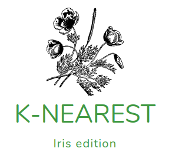

The purpose of this repository is myself practice of the K-Nearest Neighbors model. Exercise from the Book "Data Science from Scratch"

I am a student that is learning, let me know if you find any errors,**the original code is from examples and exercises found in books, tutorials and other sources all mentioned in this file.** I am just practicing what I have learned, the proper authors and creators of the algorithms/code are the ones mentioned in the file.

## The idea behind nearest neighbors classification

The model requires only a notion of distance and an assumption that points that are close to one another are similar

- It neglects a lot of information, since the prediction depends only on a few points close to the new point

- Doesn't help to understand the drives of whatever phenomenon

## Working with the Iris data set

* 3 different species
* measurements: petal and sepal length, petal and sepal width

The purpose of this project is to build a model that can predicts the species of the flower from the measurements of the petal and the sepal

## The limits of the k-nearest neighbors algorithm

We know that the k-nearest neighbors algorithm relies on the computation of distances between the labeled points and the new point, the nearest labeled points from the new point will determine the prediction.

However, the more dimensions we add, more vast is the multi dimensional space and points tend to not be close to another at all.

It will be necessary to do a dimensionality reduction if we intend to compute in higher dimensions using the k-nearest neighbors algorithm

## Resources that I used to learn about this fun topic:
Book: Data Science from Scratch, Joel Grus
